# The Hangman

Word-based guessing game built with Python

Take a Look [Here](https://the-hangman-mikeol.herokuapp.com/)

 

## Portfolio Project 3

Built with Python and deployed on Heroku, this is a terminal-based version of the popular word guessing game, Hangman. The user must guess each letter of a randomly generated, secret word. The user is represented by a stick figure, to be hung from a gallows. They have six lives with which to win the game. If they guess a letter that is not contained in the secret word, then they lose a life and the hangman draws a part of the users body on the noose.

  

### Strategy 

#### User Stories

* As a visitor I want to:
    * Intuatively know what the application is for.

* As a first-time user I want to:
    * Know the rules of the game.
    * Know how to start the game.
 
* As a user I want to:
    * Know the result of the game.
    * Choose to play again if I want to.

#### Developer Stories

* As a website developer I want to:
    * Create an application that is intuative.
    * Make a game that is enjoyable.
    * Make a game that is replayable.

  

## Logic Flow

The logic flow chart was created using Lucidchart.

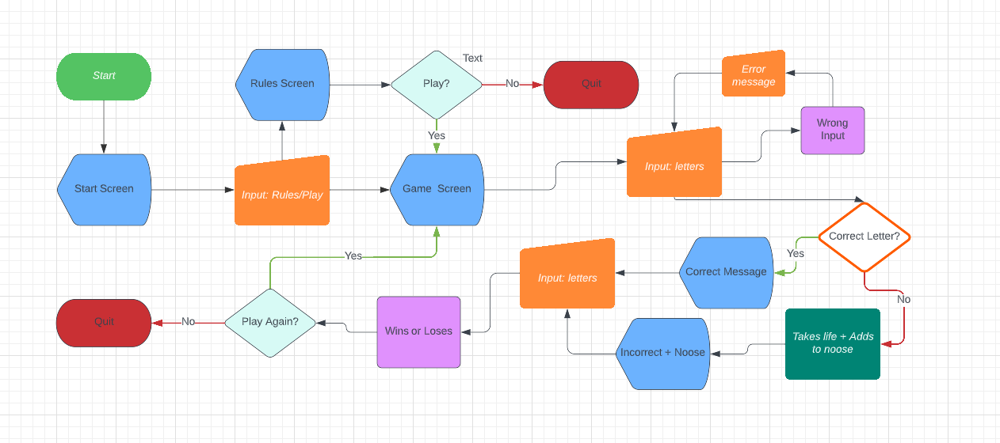

## Screens

### Start Screen

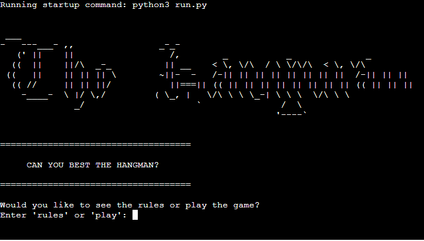

### Rules Screen

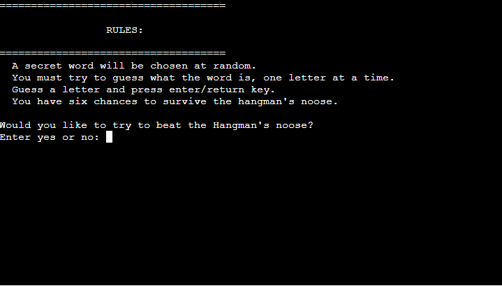

### Game Screen

#### Wrong Answer

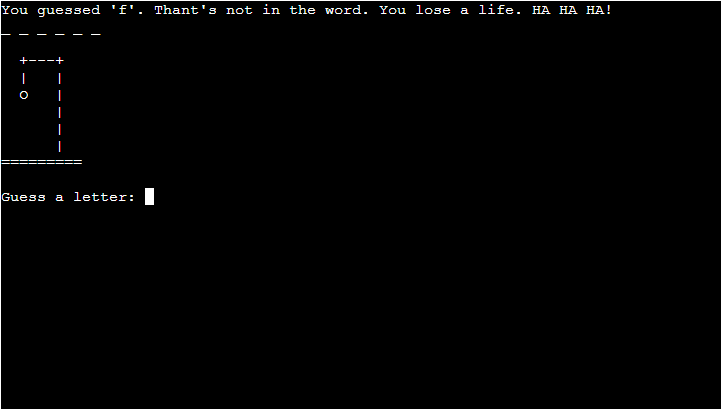 

#### Correct Answer

### End Screens

#### Win

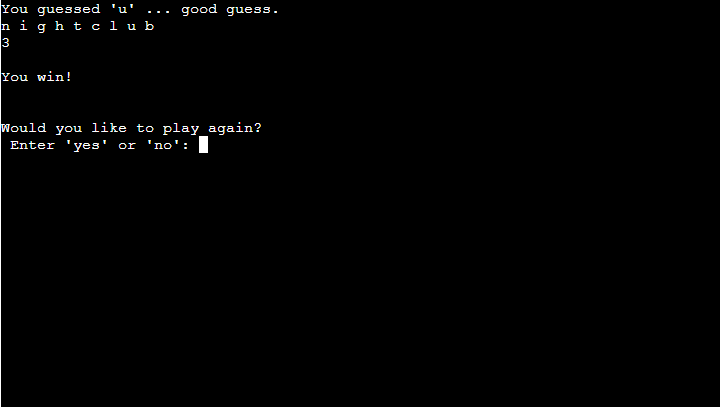

#### Lose

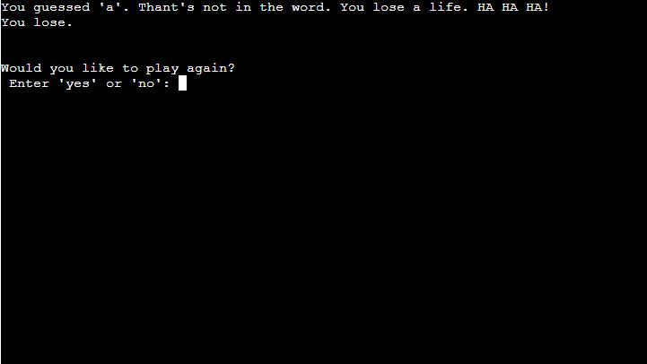

### Input Validation

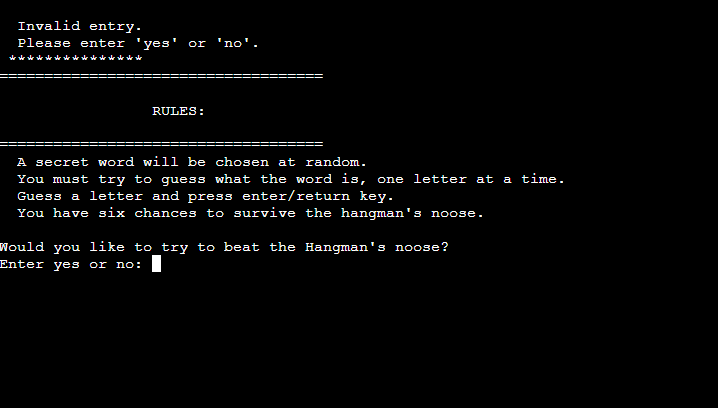

 

### Errors
If the user guesses a letter that is in the secret word more than once then the screen will output " ... good guess" for each time the letter occurs. Ideally it should only say it once.

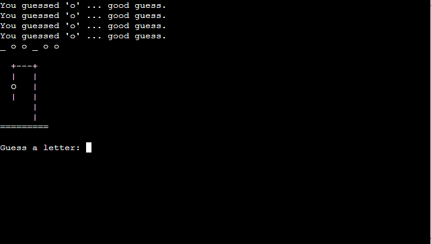

## 

### Features Left to Implement 
* Seperate pages for the most significant parts of the park which describes them in further detail.
* Maps of park trails that visitors can take whe they get there. 

## Technologies Used

* The project was written with Python.
* The project was deployed on Heroku.
* The project used Code Institute's [Gitpod Template](https://github.com/Code-Institute-Org/gitpod-full-template) 
* Github was used for hosting, utilising git version control, and for hosting the site on GitHub pages.
* [Gitpod](https://gitpod.io/) was used to write and test the code. 

* **Testing tools are credited and mentioned in the next section**

## Testing

### Validator Testing

The game was deployed and the code was tested using PEP8.

Initially there were quite a number of small errors but they were easilly remidied.

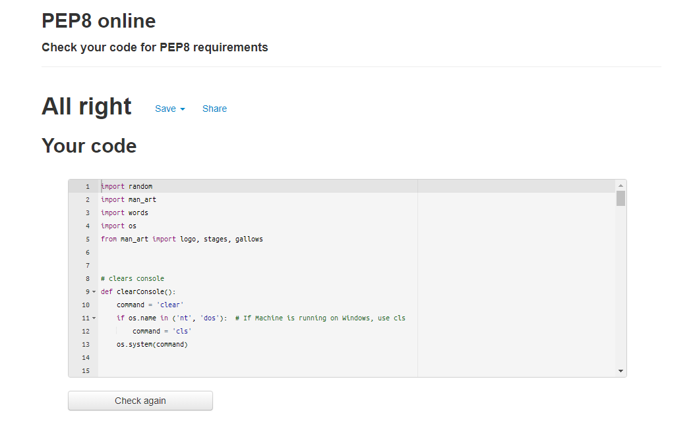

### Manual Testing
I tested all of the inputs thoughout and at the end of the project to make sure that all of my error handling was correct and that the user was getting the appropriate feedback.
 

* Start Screen
 

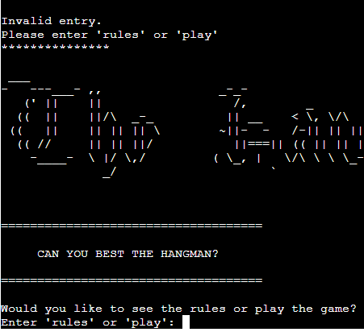
 

* Rules
 

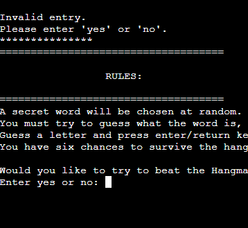

* Game 
 

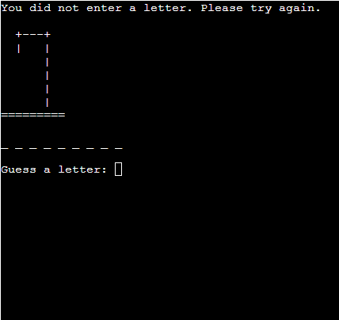
 

* Already Guessed
 

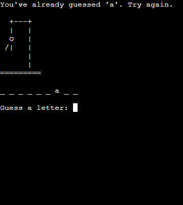
 

## Deployment

* The app was deployed on Heroku using the following method:
    * ***Because of a data breach on at Heroku, the app had to be connected manually from the terminal***
    * Log in to Heroku or create an account if required.
    * Click the button labeled New from the dashboard in the top right corner, just below the header.
    * From the drop-down menu select "Create new app".
    * Enter a unique app name. 
    * Choose Europe as region
    * Click on the "Create app" button.
    * Navigate to the settings tab and scroll down to the "Config Vars" section.
    * Click the button labelled "Reveal Config Vars" and enter the "key" as PORT, the "value" as 8000 and click the "add" button.
    * Scroll down to the buildpacks section of the settings page and click "add buildpack" select "Python" and click "Save Changes".
    * Repeat step 11 but this time add "node.js" instead of python.
    * Navigate to the "Deploy" tab.
    * Select Github as the deployment method.

## Clone and Fork

### Clone 

* In Github, click on the project that you wish to clone.
* Click the clipboard icon to copy the URL.
* The fork will now be in your repository.
* Open a new terminal.
* Change the current working directory to the location that you want the cloned directory.
* Type 'git clone' and paste the URL copied in step 2.
* Press 'Enter' to clone the project.

### Fork

* In Github, click on the project that you wish to fork.
* Click on the 'Fork' button at the top right of the page.
* The fork is now in your repository.

## Credits

I like to say a massive "Thank You" to my mentor, Ben Kavanagh. He's a fantastic motivator and extremely helpful. I would also like to thanks my classmates and cohort facilitator, Kasia Bogucka. Also a big thanks to all the helpful people in the Slack community!

### Code

Python code was adapted and learned from the following sources: 
* Core logic adapted from this tutorial on [Udemy](https://www.udemy.com/course/    
* Python tips from Corey Schafer on [YouTube](https://www.youtube.com/channel/      UCCezIgC97PvUuR4_gbFUs5g)
* The Hangman title from [ASCII](http://www.network-science.de/ascii/) generator.

